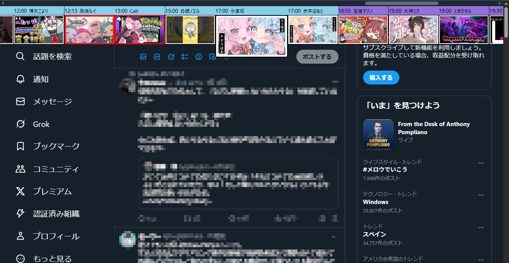

# Holodule Anywhere

ページの上にホロジュールを表示できるChrome拡張機能

## 使い方

任意のページで`E`または`Z`または`H`キーを押すと、ホロジュールの配信枠を上部に表示します。

表示する配信はオプションで設定できます。

ホロジュールの配信データは[公式サイト](https://schedule.hololive.tv/lives)から取得しています。
アクセス負荷を減らすため、前回の取得から5分経った場合のみ再取得します。
ホロジュール取得時、UIの表示が1秒程度遅くなりますが仕様です。

## ショートカットキー

| ショートカットキー                 | 説明                             |
| ---------------------------------- | -------------------------------- |
| `E` or `Z` or `H`                  | ホロジュールを表示(または非表示) |
| `Esc`                              | ホロジュールを非表示             |
| `Left` or `A` or `Shift + Tab`     | 1つ左の配信を選択                |
| `Right` or `D` or `Tab`            | 1つ右の配信を選択                |
| `Home`                             | 一番左の(一番古い)配信を選択     |
| `End`                              | 一番右の(最新の)配信を選択       |
| `Enter` or `Space`                 | 選択中の配信を開く               |
| `Shift + Enter` or `Shift + Space` | 選択中の配信を新しいタブで開く   |

## 更新履歴

- 1.3.2 バグ修正
- 1.3.1 配信活動終了者を削除
- 1.3.0 表示する配信のフィルタ機能を追加、背景色を変更、バグ修正
- 1.2.1 UI表示時に配信データを取得する機能を追加、背景色を変更
- 1.2.0 ダークモード対応削除、時間帯により背景色を設定する機能を追加
- 1.1.0 配信開始時刻と配信者名の表示機能を追加、ダークモード対応
- 1.0.1 バグ修正
- 1.0.0 完成
